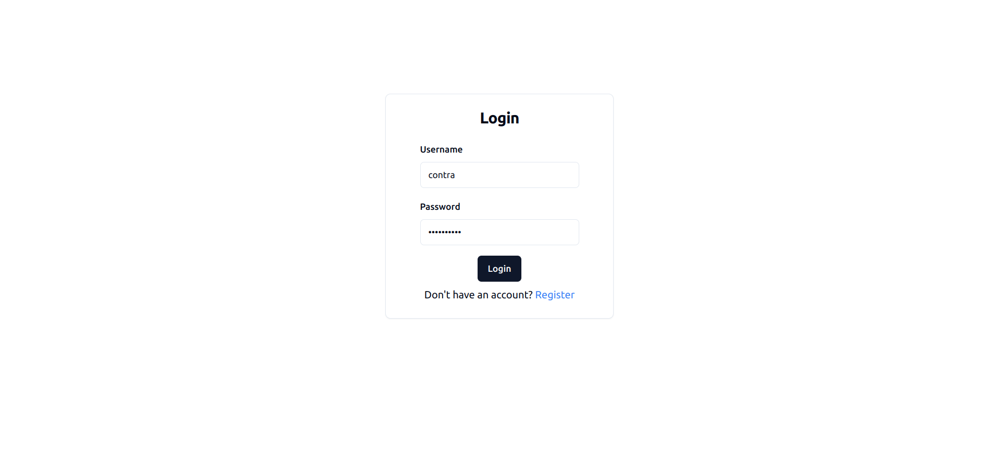
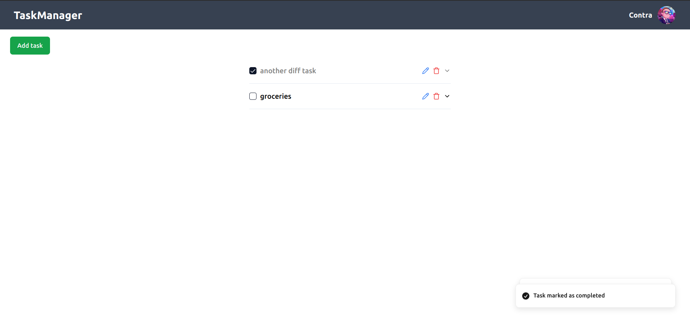
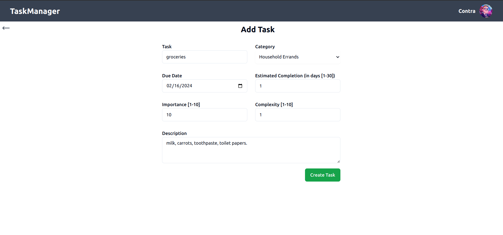
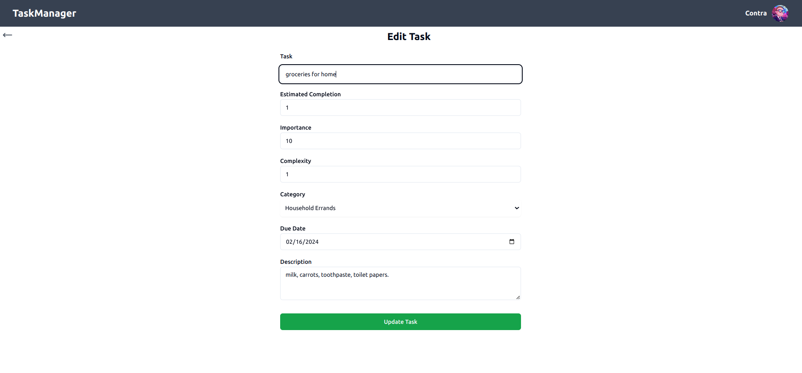

# Task Manager

Task Manager is a project developed to assist you in managing your tasks effectively. Leveraging machine learning models, it assigns priorities to your tasks, enabling you to prioritize and complete them efficiently. The project utilizes a Python Django backend with a RESTful API for communication with the front end, which is developed using Typescript and React.

Task Manager serves as a comprehensive tool for individuals and teams to streamline their task management process. Whether you're a busy professional juggling multiple responsibilities or a team leader overseeing various projects, this project helps in organizing and prioritizing tasks effectively. By leveraging machine learning, it offers intelligent task prioritization, enhancing productivity and time management.

## Features

- JWT Token Authentication: Secure user registration and login with profile views.
- Task Management: Create, update, delete, and mark tasks as complete with respective details.
- Machine Learning Priority Assignment: Utilizes a machine learning model (SVM) to assign priority to tasks based on provided details.
- User-friendly UI: Attractive interface to visualize and manage prioritized tasks.

## ML Model (SVM)

The SVM model in this project is trained using the Jupyter Notebook environment. It's designed to analyze task details and assign priorities based on various factors such as deadline, category, estimated time to complete task, complexity, and importance to calsulate a priority value and assign it to the task.

## Tools Used

- Django
- Jupyter Notebook (SVM model)
- Typescript
- React
- ZOD
- react-hook-form
- Axios
- Shadcn
- Tailwind CSS

## Contributors

- Sandesh G.C. - Frontend - [GitHub](https://github.com/SandeshGC)
- Dikshyant Dhungana - Frontend - [GitHub](https://github.com/dikshyant3)
- Rupesh Ghimire - Backend and ML

Frontend contributors Dikshyant Dhungana and Sandesh G.C. have demonstrated exceptional expertise in crafting intuitive user interfaces, enhancing the Task Manager's usability and aesthetics.
A big thanks to them.

## Screenshots

- Login Page
  

- Landing Page
  

- Add Task Page
  

- Edit Task Page
  

